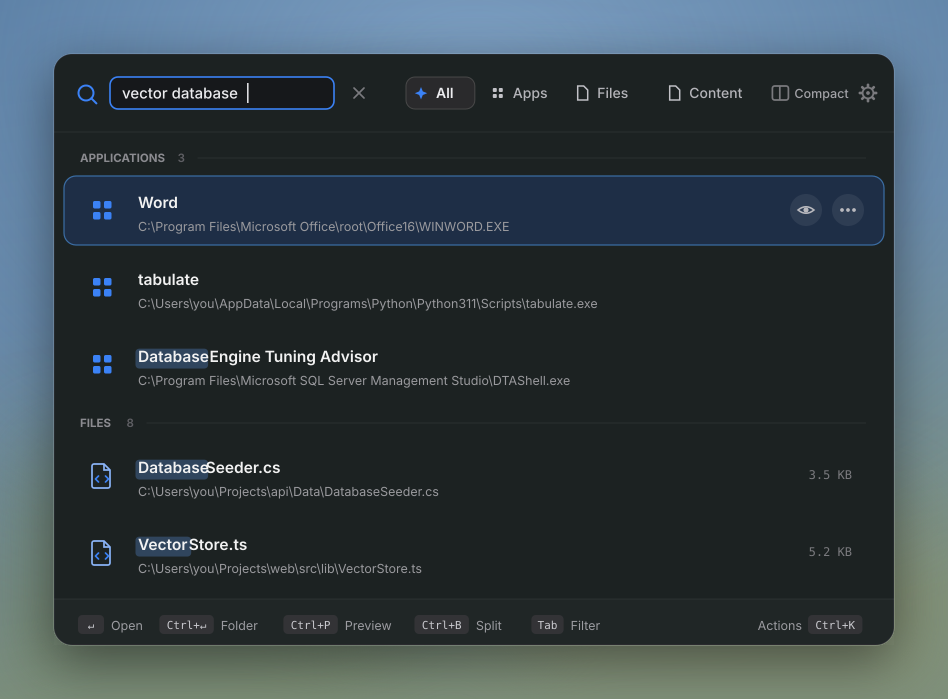
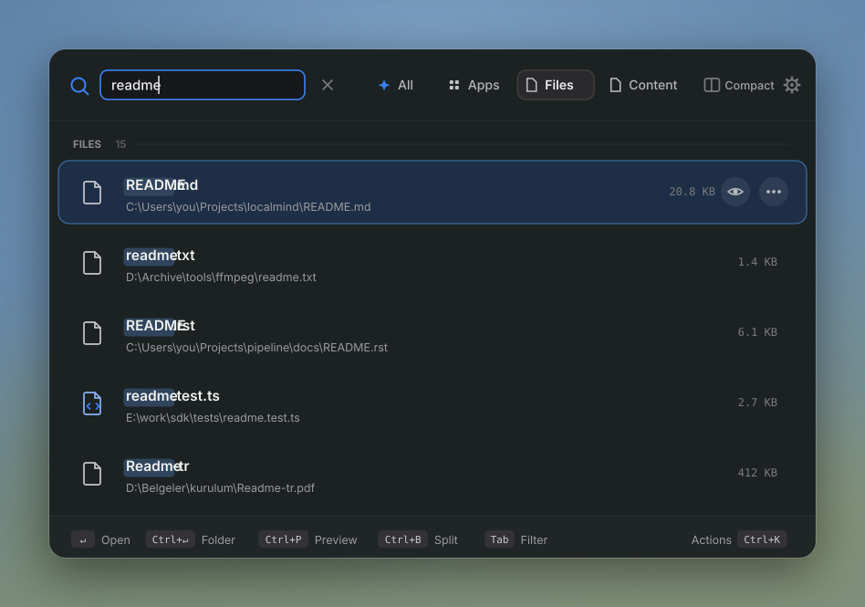
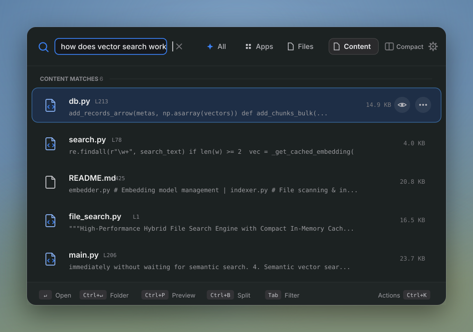
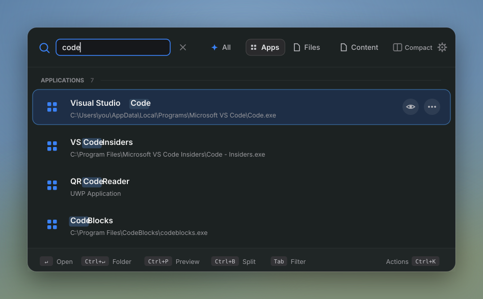
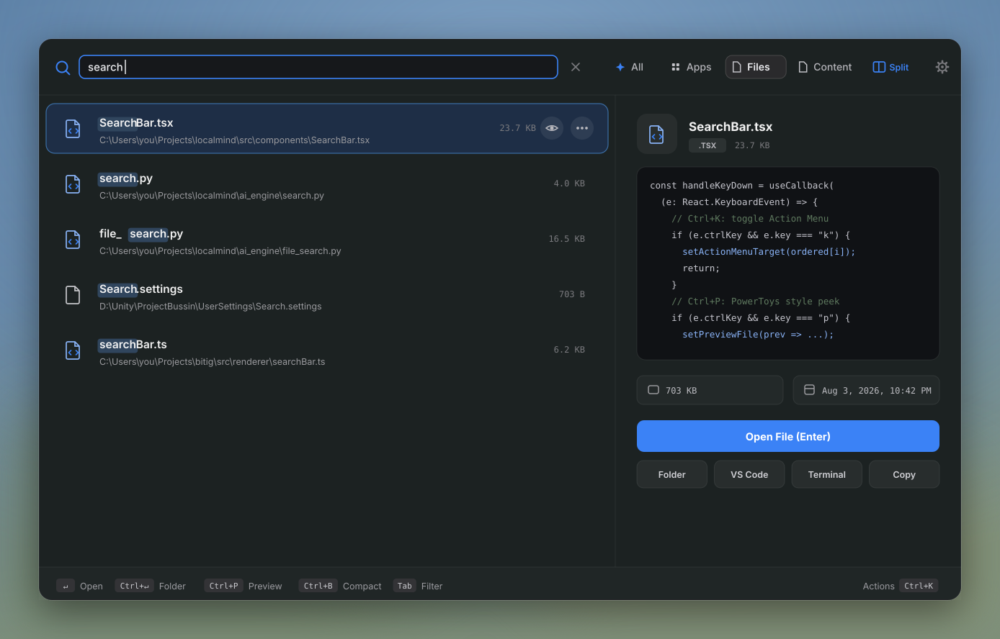
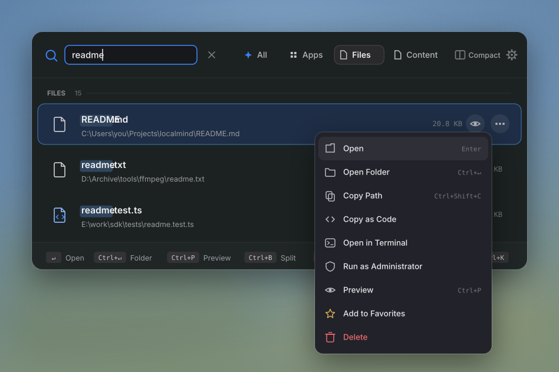
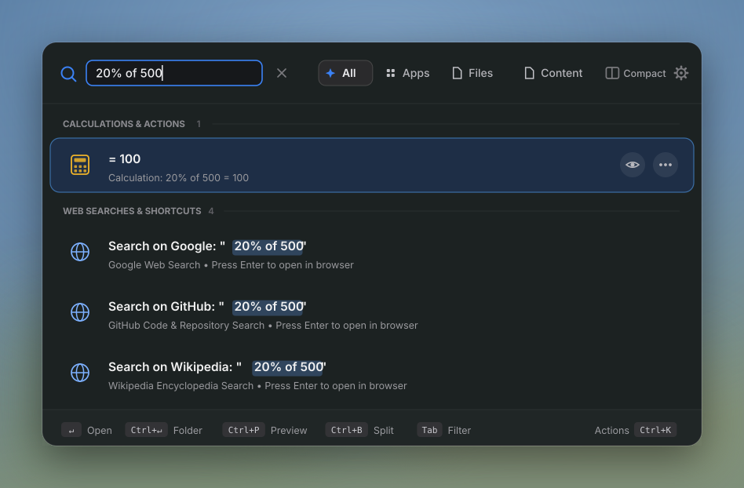
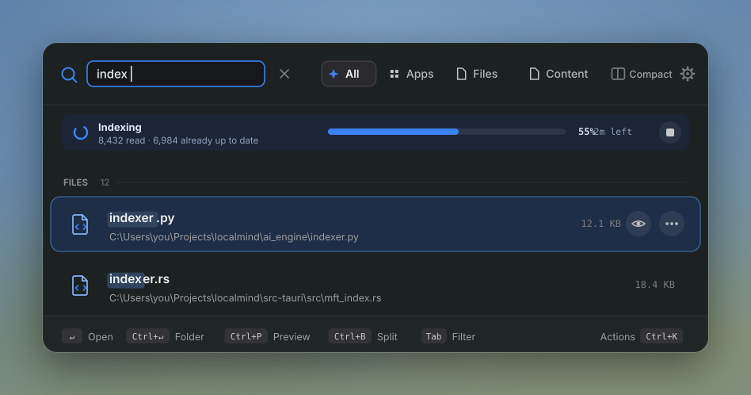
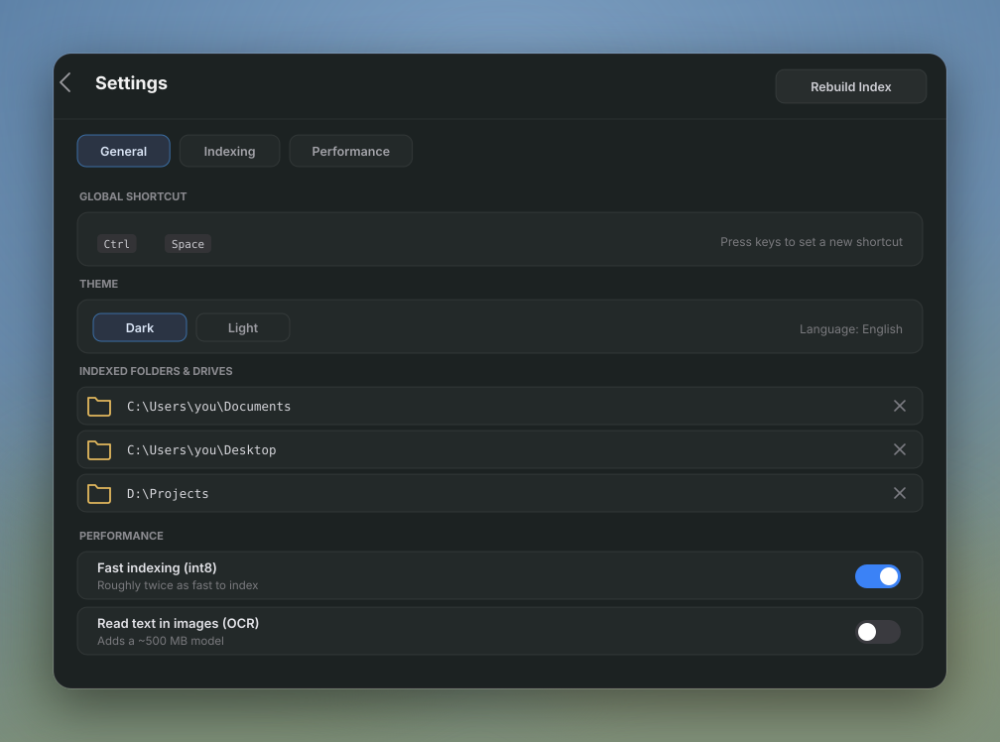
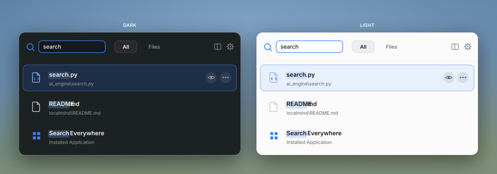

<div align="center">


# LocalMind v2 is finally out

### The AI search your PC should have shipped with.

**Every file. Every word inside every file. Every app. In under a second. Fully offline.**

<p>
  
  
  
  
</p>

<p>
  
  
  
  
  
  
</p>

<p>
  <a href="#quick-start"><b>Quick Start</b></a> ·
  <a href="#whats-new-in-v2"><b>What's New</b></a> ·
  <a href="#the-full-feature-tour"><b>Features</b></a> ·
  <a href="#architecture"><b>Architecture</b></a> ·
  <a href="#privacy"><b>Privacy</b></a>
</p>

<br />



<sub><i>One hotkey. One search bar. Files, content, apps, math, conversions, all ranked together.</i></sub>

</div>

<br />

## What's New in v2

v1 was a semantic search tool. **v2 is a full launcher, and it is dramatically faster.**

| | v1 | v2 |
|---|---|---|
| **File name search** | Python directory walk, seconds on large drives | **Native Rust NTFS MFT scanner, sub millisecond across 1M+ files** |
| **Coverage** | Only the folders you configured | **Every NTFS drive on the machine** |
| **Apps** | Basic shortcut list | **Start Menu, UWP apps and system settings, with real 32 bit extracted icons** |
| **Results** | Separate tabs you had to switch between | **One unified, grouped, ranked list** |
| **Actions** | Open file | **Open, reveal, copy path, copy as code, terminal, run as admin, favorite, delete** |
| **Preview** | Inline snippet | **Full split preview panel with syntax highlighting and metadata** |
| **Extras** | None | **Calculator, unit and currency conversion, system actions, web search shortcuts** |
| **Fallback** | None | **Windows Search Indexer fallback when running unelevated** |
| **Engine control** | Fixed | **OCR toggle, hardware aware int8 quantization** |
| **Indexing throughput** | Baseline | **~1.6x faster end to end, on ~30% less peak memory** |
| **Native index footprint** | 3 heap allocations per file | **Zero: names live in one arena per volume, ~65 MB less per million files** |

Everything below is local. No account, no API key, no network call, no telemetry. Ever.

<br />

## Why LocalMind

Windows Search is fast at file names but blind to what is inside your files. Cloud AI search tools understand your content but only after uploading it. LocalMind refuses that tradeoff and runs both engines on your own machine:

<table>
<tr>
<td width="33%" valign="top">

### Native speed

A Rust engine reads the **NTFS Master File Table** directly via `FSCTL_ENUM_USN_DATA`, bypassing the file system entirely, then searches an in memory index in parallel across every CPU core with `rayon`.

</td>
<td width="33%" valign="top">

### Real understanding

A local Python sidecar chunks and embeds the text inside your documents and code with a multilingual MiniLM model running on ONNX Runtime, so you can search by **meaning**, not just by file name — in English and Turkish alike.

</td>
<td width="33%" valign="top">

### Absolute privacy

The model, the vector database and the file index all live on disk in `~/.localmind/`. The sidecar only ever listens on `127.0.0.1`. Nothing is uploaded, ever.

</td>
</tr>
</table>

<br />

## The Full Feature Tour

### Instant native file search



Start typing and results appear before you finish the word. LocalMind builds an in memory index straight from the NTFS Master File Table, so it never walks directories and never waits on disk. A million files across multiple drives are searched in **well under a second**, and the index covers your whole PC rather than a handful of folders you had to configure in advance.

If LocalMind is running without administrator rights, it transparently falls back to the Windows Search Indexer (`Search.CollatorDSO`) over a persistent ADODB connection, so you still get fast whole PC results with no setup.

**Highlights**

- Direct NTFS MFT and USN Journal access, no directory traversal
- Parallel search across all CPU cores with `rayon`
- Automatic Windows Search Indexer fallback when unelevated
- Noise filtering for `node_modules`, `__pycache__`, `.git`, temp and recycle bin paths
- Smart token normalization, so `gamer's` and `gamers` both match

<br />

### Semantic content search



Ask for what you remember, not for what the file is called. *"that Docker PDF I downloaded"*, *"the React login component"*, *"jwt auth implementation"*. LocalMind encodes your query with a multilingual MiniLM-L12 model, compares it against every text chunk stored in LanceDB, and returns the closest matches with the exact line range, so you land on the relevant paragraph rather than on the top of a 90 page document.

**Highlights**

- Local multilingual MiniLM-L12 embeddings, downloaded once and cached in `~/.localmind/models`
- LanceDB vector store, file based, no server process to run
- Overlapping ~500 character chunks with full line tracking
- Relevance score and line range shown on every hit
- int8 quantization for a ~2.2x smaller memory footprint, chosen automatically on CPU-only machines
- Optional OCR for scanned images and screenshots

<br />

### App launcher with real native icons



A native Windows scanner discovers Start Menu shortcuts (`.lnk`), UWP applications and system settings panels, then extracts the full resolution 32 bit icons directly from the executables. The result is a launcher that looks native instead of a list of generic gray file icons.

**Highlights**

- Start Menu, UWP and Windows Settings coverage in one index
- High resolution icon extraction straight from the binaries
- Apps ranked alongside files, so `chrome` finds the browser, not a log file

<br />

### Split preview panel



Select any result and read it without leaving the search bar. Code and text are syntax highlighted with `highlight.js`, and the panel shows the metadata that actually matters: full path, size, modified date and file type, plus one click actions.

**Highlights**

- Syntax highlighting across every supported language
- Jumps directly to the matched line for semantic hits
- File metadata at a glance
- Toggle it any time with `Ctrl+P`

<br />

### An action menu on every result



Finding the file is half the job. Every result carries a full action menu you can drive entirely from the keyboard.

**Available actions**

| Action | What it does |
|---|---|
| Open | Launch the file with its default application |
| Open folder | Reveal the file in Explorer |
| Copy path | Put the absolute path on the clipboard |
| Copy as code | Copy the content as a formatted code snippet |
| Open in terminal | Launch a shell in the containing directory |
| Run as administrator | Relaunch the target elevated |
| Preview | Open it in the split preview panel |
| Favorite | Pin frequently used results to the top |
| Delete | Send the file to the recycle bin |

<br />

### Calculator, converter and system actions



The search bar is already open, so it may as well do the small things too. Type an expression and get a copyable answer instantly, with no separate calculator app and no browser tab.

**What it understands**

- Arithmetic and math functions: `sqrt(144) * 3`, `log10(1000)`, `2^16`
- Percentages: `20% of 500`
- Hex conversion: `0xff`
- Currency and unit conversion: `120 usd`, offline baseline rates included
- System actions: `lock`, `sleep`, `restart`, `shutdown`, `empty trash`, `my ip`
- Web search shortcuts, when you already know the answer is not on your disk

<br />

### Grouped and ranked results

Files, semantic matches, apps, calculations, conversions and web shortcuts are produced by different subsystems, then merged into a **single scannable list** with category grouping and a shared ranking. You never have to decide which mode you are in before you type, and keyboard navigation flows straight through the whole list.

<br />

### An index that keeps itself current



A `watchdog` based file system watcher detects created, modified and deleted files in real time and updates the vector index incrementally. Indexing is resumable and skips anything already processed, so you never sit through a full rebuild.

**Highlights**

- Real time create, modify and delete handling
- Incremental indexing, only new and changed files are embedded
- Live progress in the UI while the engine works
- Configurable folders, exclude patterns and maximum file size

<br />

### Global hotkey, from anywhere

`Ctrl+Space` summons a floating, always on top, frameless search window over whatever you were doing, and it disappears the moment you are finished. LocalMind lives in the system tray, can start with Windows, and stays out of the taskbar until you call it.

<br />

### Configurable, themed and multilingual





Dark and light themes, English and Turkish out of the box (the i18n layer is ready for more), a rebindable global shortcut, autostart, indexed folder management, exclude patterns, file size limits, an OCR toggle and an embedding quantization toggle, all from one settings panel.

<br />

## Supported File Types

| Category | Extensions |
|---|---|
| **Text & Config** | `.txt` `.md` `.json` `.csv` `.xml` `.yaml` `.yml` `.toml` `.log` `.env` `.sql` |
| **Source Code** | `.js` `.ts` `.tsx` `.jsx` `.py` `.rs` `.go` `.java` `.c` `.cpp` `.h` `.rb` `.sh` `.bat` `.html` `.css` `.r` |
| **Documents & Books** | `.pdf` `.docx` `.xlsx` `.pptx` `.ipynb` `.epub` `.rtf` |
| **Images** *(OCR, optional)* | `.png` `.jpg` `.jpeg` `.bmp` `.tiff` |

<br />

## Architecture

```
┌────────────────────────────┐        ┌──────────────────────────────┐
│   React + TypeScript        │  IPC   │        Tauri v2 (Rust)        │
│   Tailwind CSS + Vite        │◄──────►│                                │
│                              │        │  • Window management          │
│  • SearchBar / ActionMenu    │        │  • Global shortcut             │
│  • ResultsList / Grouping    │        │  • System tray                 │
│  • SplitPreviewPanel         │        │  • Sidecar lifecycle           │
│  • SettingsPanel             │        │  • Native MFT / NTFS scanner   │
│  • EngineStatus               │        │  • App & icon scanner          │
│  • i18n (EN / TR)             │        │  • Self elevation              │
└────────────────────────────┘        └───────────────┬────────────────┘
                                                        │
                                            HTTP · 127.0.0.1:<port>
                                                        │
                                        ┌───────────────┴────────────────┐
                                        │        Python AI Engine         │
                                        │        (FastAPI sidecar)        │
                                        │                                  │
                                        │  • ONNX Runtime embeddings       │
                                        │    (multilingual MiniLM-L12)     │
                                        │  • LanceDB vector store          │
                                        │  • watchdog file watcher         │
                                        │  • Text extractors                │
                                        │  • Windows Search fallback        │
                                        │  • Evaluator (math / conversions) │
                                        └──────────────────────────────────┘
```

### How It Works

**Instant search flow (Rust)**

1. User types a query, the frontend sends it to the Tauri backend
2. The in memory MFT index (built from the NTFS Master File Table, or from the Windows Search Indexer as a fallback) is queried in parallel across CPU cores
3. File and app matches return in well under a second, even on drives holding millions of entries

**Semantic search flow (Python sidecar)**

1. In parallel, the frontend sends `POST /search` to the local sidecar
2. The sidecar encodes the query with a multilingual MiniLM-L12 model through ONNX Runtime (DirectML on a DirectX 12 GPU when one is available, otherwise CPU)
3. LanceDB returns the top-*k* nearest chunks
4. Results (file path, snippet, relevance score, line range) are merged into the same UI list

**Indexing flow**

1. Streams the configured folders with `os.scandir`, reusing the stat data the directory listing already returned
2. Skips anything whose size and modification time still match the stored hash, so a re-index only touches what changed
3. Extracts text on a worker pool with PyMuPDF, `python-docx`, `openpyxl`, `python-pptx`, plain text readers and optional OCR
4. Splits text into overlapping ~500 character chunks with line tracking
5. Groups chunks by length and embeds them in batches, optionally int8 quantized
6. Buffers the resulting rows and writes them to LanceDB, a local file based database that needs no server
7. `watchdog` monitors the file system and updates the index incrementally

Extraction and embedding run concurrently: the worker pool always has files in flight, so the model is never waiting on a slow PDF and the disk is never waiting on the model.

<br />

## Performance

Indexing speed and memory use are the two things you actually feel, so both are treated as features rather than side effects.

**Where indexing time goes, and what was done about it**

| Change | Effect |
|---|---|
| **Length-grouped, dynamically padded batches** | Chunks are sorted by length and each batch is padded to its own longest sequence instead of a fixed 192 tokens. A short chunk no longer costs a full-length forward pass. **2.7x** faster embedding on a mixed corpus. |
| **Buffered database writes** | Rows are accumulated and written to LanceDB in batches rather than one write per embedding batch. Every write creates a dataset fragment, and thousands of tiny fragments were slow to produce and slow to compact afterwards. **~30x** faster on the write path (20k rows: 6.9s → 0.2s). |
| **Continuous extraction pipeline** | Extraction workers are re-fed as each result is consumed, instead of draining a fixed window before starting the next one. No worker sits idle behind the slowest file in its window. |
| **Rate-limited index statistics** | The distinct-file rollup behind `/index/stats` needs a full column scan. The UI polls it every second, so during a run the engine used to rescan the whole table once per second while it was already busy. |

End to end on a mixed 900-file corpus (13,836 chunks): **70.8s → 45.3s, a 1.56x speedup, with peak memory falling from 38.3 MB to 27.8 MB.**

**Where memory goes, and what was done about it**

| Change | Effect |
|---|---|
| **Arena-backed native index** | An MFT record used to own three separate `String`s (`name`, `name_lower`, `ext`). Names now live in one arena per volume and a record is a fixed 32-byte slice reference; the extension is derived on demand. **~65 MB less per million files**, and zero heap allocations per file instead of three. |
| **Bounded search result selection** | A broad query used to collect *every* match before sorting it. Only the best candidates are kept now, which bounds both the allocation and the sort. |
| **Streaming folder scan** | The scan yields entries instead of materializing one record per candidate file. On a re-index, unchanged files cost a single path string rather than a full entry — **~33 MB less at 150k files**. |
| **Released hash cache** | The path-to-hash map that answers "has this file changed?" is dropped when a run finishes and rebuilt lazily on the next one, instead of sitting resident for the life of the sidecar. |
| **Memory-balanced batch size** | The inference batch is the main memory dial, since activations scale with batch size. 32 measured within 10% of 64 while holding 24 MB less, so it is the default. |

**int8 quantization is a real tradeoff, not a free win**

The embedding model is the largest single thing LocalMind holds, and its precision decides both how much memory that is and how fast indexing runs. Measured on a mixed 600-chunk batch:

| Model precision | Execution provider | Throughput | Peak process memory |
|---|---|---|---|
| fp32 | DirectML (GPU) | **448 chunks/s** | 1216 MB |
| fp32 | CPU | 112 chunks/s | 1143 MB |
| int8 | CPU | 206 chunks/s | **556 MB** |

Dynamic quantization emits operations DirectML cannot execute, so an int8 graph falls back to the CPU no matter what hardware you have. That leads to a rule with no exceptions:

- **On a DirectX 12 GPU**, fp32 is 2.2x faster and int8 is 2.2x lighter. Neither wins outright, so LocalMind leaves the choice to you and defaults to fp32.
- **On a CPU-only machine**, int8 is both faster *and* lighter than fp32. There is nothing to weigh, so LocalMind uses it.

The quantization toggle in settings overrides this whenever you want. Switching it rewrites the index, because the two precisions produce different vectors. Choosing int8 also skips the GPU provider entirely, which saves a further ~155 MB that would otherwise be held for a GPU partition the quantized graph never uses.

Figures come from the benchmarks in this repository's history and from `cargo test --lib footprint -- --nocapture`, which prints the per-record footprint table. They will vary with your CPU, GPU, drive and corpus.

<br />

## Tech Stack

| Layer | Technology |
|---|---|
| Desktop shell | [Tauri v2](https://v2.tauri.app/) · Rust |
| Frontend | React 19 · TypeScript · Vite · Tailwind CSS v4 |
| Native search engine | Rust · `rayon` · NTFS MFT / USN Journal · Windows Search fallback |
| AI engine | FastAPI · Uvicorn · Python |
| Embeddings | [ONNX Runtime](https://onnxruntime.ai/) (DirectML) · `paraphrase-multilingual-MiniLM-L12-v2` · `tokenizers` |
| Vector database | [LanceDB](https://lancedb.com/) · `pyarrow` |
| Text extraction | `PyMuPDF` · `python-docx` · `openpyxl` · `python-pptx` · `pdfplumber` (fallback) |
| File watching | `watchdog` |
| Syntax highlighting | `highlight.js` |
| i18n | `i18next` · `react-i18next` |

<br />

## Prerequisites

| Dependency | Minimum version | Install |
|---|---|---|
| Node.js | 18+ | [nodejs.org](https://nodejs.org/) |
| Rust | 1.77.2+ | [rustup.rs](https://rustup.rs/) |
| Python | 3.10+ | [python.org](https://www.python.org/) |

> LocalMind's native search engine relies on Windows specific APIs (NTFS MFT access, UWP app scanning, native icon extraction), so it currently targets **Windows 10 and 11**.

<br />

## Quick Start

```bash
# Clone
git clone https://github.com/sametgurtuna/localmind.git
cd localmind

# Frontend dependencies
npm install

# Python dependencies
cd ai_engine
pip install -r requirements.txt
cd ..

# Launch in development mode
npm run tauri dev
```

> **First run:** the multilingual MiniLM-L12 model downloads automatically and is cached in `~/.localmind/models` for every later launch. On a CPU-only machine it is converted to int8 once, which takes about a minute and is then reused. For full speed native file search LocalMind can request administrator privileges to read the NTFS Master File Table directly; without elevation it falls back to the Windows Search Indexer automatically, so it works either way.

<br />

## Production Build

```bash
# 1. Package the Python sidecar as a standalone binary
cd ai_engine
pip install pyinstaller
python build.py          # outputs to src-tauri/binaries/
cd ..

# 2. Build the Tauri desktop installer
npm run tauri build       # outputs to src-tauri/target/release/bundle/
```

<br />

## Configuration

All settings are reachable from the in-app settings panel (gear icon) or the system tray menu.

| Setting | Default | Description |
|---|---|---|
| Global Shortcut | `Ctrl+Space` | Toggle the floating search window |
| Theme | Dark | Dark or Light |
| Language | English | English / Turkish |
| Autostart | Enabled | Launch with the operating system |
| Max File Size | 50 MB | Skip files larger than this |
| Indexed Folders | Documents, Downloads, Desktop | Folders scanned recursively for content indexing |
| Exclude Patterns | `node_modules`, `*.min.js`, `*.log`, `.git` | Glob patterns to ignore |
| OCR | Off | Extract text from scanned images, adds roughly 500 MB of models |
| Embedding Quantization | Auto | int8 model: ~2.2x less memory, and on a CPU-only machine ~1.8x faster too. Auto picks int8 when there is no GPU, fp32 when there is. See [Performance](#performance). Changing it moves every vector to a different space, so the index is rebuilt |

Engine level settings are also controllable through environment variables (`LOCALMIND_OCR`, `LOCALMIND_QUANTIZE`), which always take precedence over the stored configuration. `LOCALMIND_QUANTIZE=auto` restores the hardware based choice.

### Performance tuning

The defaults are tuned for a balance of speed and memory on an ordinary laptop and should not need touching. If you want to trade one for the other, these environment variables are read by the sidecar at startup:

| Variable | Default | What it does |
|---|---|---|
| `LOCALMIND_EMBED_BATCH` | `32` | Chunks per model forward pass. The main memory dial: activations scale with it. Raise it for throughput on a machine with RAM to spare, lower it if the sidecar is squeezed |
| `LOCALMIND_EMBED_POOL` | `128` | Chunks handed to the embedder at once. Larger pools give length grouping more to work with and waste less padding |
| `LOCALMIND_DB_FLUSH_ROWS` | `1000` | Rows buffered before a LanceDB write. Larger means fewer, bigger fragments on disk |
| `LOCALMIND_EXTRACT_WORKERS` | half your cores, max 6 | Parallel text extraction threads. Extraction and the embedding model compete for the same cores, so giving extraction all of them makes indexing slower, not faster |
| `LOCALMIND_INDEX_WINDOW` | `24` | Files held in flight. This is what bounds peak memory during a run |
| `LOCALMIND_MAX_SEQ` | `192` | Token ceiling per chunk |
| `LOCALMIND_PAD_MULTIPLE` | `32` | Batches pad to their longest sequence rounded up to this. Smaller wastes less padding but shows the model more distinct input shapes to plan for |
| `LOCALMIND_ONNX_THREADS` | half your cores, max 8 | ONNX Runtime intra-op threads |
| `LOCALMIND_STATS_INTERVAL` | `15` | Seconds between full recounts behind `/index/stats` |
| `LOCALMIND_MAX_PDF_PAGES` | `200` | Pages read per PDF |
| `LOCALMIND_MAX_CHUNKS_PER_FILE` | `200` | Chunks kept per file, so one huge document cannot monopolize a run |

<br />

## Keyboard Shortcuts

| Shortcut | Action |
|---|---|
| `Ctrl+Space` | Show / hide LocalMind |
| `Tab` | Cycle search tabs (Files → Semantic → Apps) |
| `Enter` | Open selected result |
| `Ctrl+Enter` | Open containing folder |
| `Ctrl+P` | Toggle the split preview panel |
| `Ctrl+Shift+C` | Copy the selected result's file path |
| `Ctrl+1`-`9` | Open the Nth result directly |
| `Esc` | Clear search / dismiss the window |

<br />

## Project Structure

```
localmind/
├── src/                        # React frontend
│   ├── components/             #   SearchBar, ResultsList, ActionMenu,
│   │                           #   SplitPreviewPanel, EngineStatus, SettingsPanel, …
│   ├── hooks/                  #   useSearch, useSidecar, useEngineSettings, useTheme, …
│   ├── i18n/                   #   Translation files (en.json, tr.json)
│   └── lib/                    #   api, config, converter, grouping, webSearch
├── src-tauri/                  # Tauri backend (Rust)
│   ├── src/                    #   commands, sidecar, tray, window,
│   │                           #   mft_index, ntfs, apps, elevation
│   └── capabilities/           #   Permission declarations
├── ai_engine/                  # Python AI sidecar
│   ├── main.py                 #   FastAPI server & startup
│   ├── embedder.py             #   Embedding model management
│   ├── indexer.py              #   File scanning & indexing
│   ├── search.py               #   Semantic search logic
│   ├── db.py                   #   LanceDB operations
│   ├── extractor.py            #   Text extraction (PDF, DOCX, XLSX, PPTX, …)
│   ├── chunker.py              #   Text chunking with line tracking
│   ├── watcher.py              #   Real time file system watcher
│   ├── file_search.py          #   Fuzzy file name search
│   ├── winsearch.py            #   Windows Search Indexer fallback (ADODB)
│   ├── app_launcher.py         #   Installed app discovery
│   ├── evaluator.py            #   Math, unit and quick action evaluator
│   ├── query_parser.py         #   Query preprocessing
│   ├── settings.py             #   Engine settings persisted outside the UI
│   └── build.py                #   PyInstaller build script
├── docs/screenshots/           # README images
├── .github/workflows/ci.yml    # CI pipeline
├── package.json
├── LICENSE
└── README.md
```

<br />

## Privacy

LocalMind is local only by design, not as an option you have to find and enable:

- **Zero cloud dependency.** No API keys, no external endpoints, no account.
- **Zero telemetry.** No analytics, no tracking, no crash reporting.
- **Zero data upload.** Your files and embeddings never leave `~/.localmind/`.
- **Localhost only IPC.** The sidecar binds exclusively to `127.0.0.1`.
- **Native search stays native.** The NTFS MFT scanner and the Windows Search fallback never send file metadata off the device.

<br />

## Contributing

Contributions are welcome. Please open an issue first to discuss what you would like to change, then submit a pull request.

<br />

## License

[MIT](LICENSE)

<div align="center">
<br />
<sub>Built for people who have too many files and too little patience.</sub>
</div>
